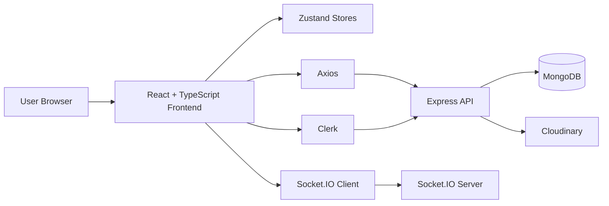
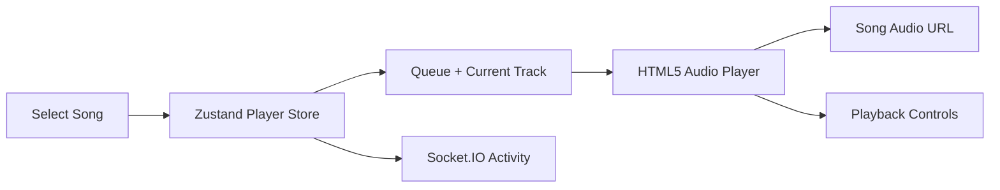
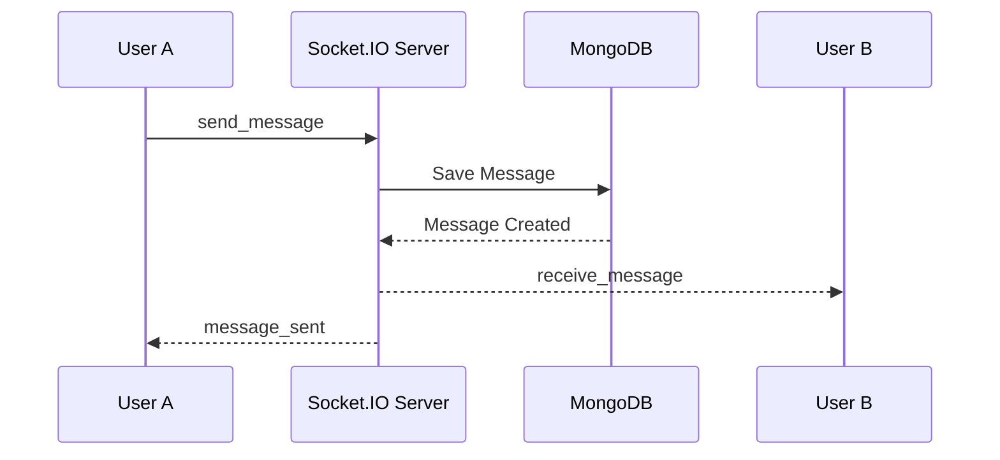
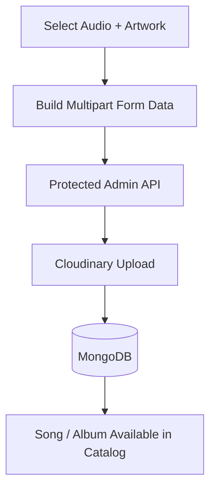

<div align="center">

  <h1>Advanced Spotify Clone</h1>

  <p><strong>Full-Stack Music Streaming & Real-Time Social Experience</strong></p>

  <p>
    A Spotify-inspired full-stack music streaming application with album browsing,
    custom playback controls, queue management, real-time chat, listening activity,
    authentication, and an admin dashboard for managing songs and albums.
  </p>

  <p>
    <a href="https://advanced-spotify-clone-mp5l.onrender.com/">
      
    </a>
    <a href="https://github.com/khushiiish/ADVANCED-SPOTIFY-CLONE">
      
    </a>
  </p>

  <p>
    
    
    
    
    
    
    
    
  </p>

  <sub>Spotify-inspired educational and portfolio project. Not affiliated with Spotify AB.</sub>

</div>

## Live Demo

The application is deployed on Render and available here:

### [Open Advanced Spotify Clone](https://advanced-spotify-clone-mp5l.onrender.com/) ↗

The application uses Clerk for authentication. Public music content can be explored from the deployed application, while authenticated features such as chat require a signed-in user. Admin functionality is restricted to configured administrator email addresses.

## About the Project

Advanced Spotify Clone is a full-stack music streaming application inspired by the Spotify experience. It combines a React + TypeScript frontend with a Node.js + Express backend, MongoDB persistence, Clerk authentication, Cloudinary media storage, and Socket.IO real-time communication.

The project focuses on building a complete application workflow rather than only reproducing a static Spotify-style interface.

## Features

### 🎵 Music & Playback

- Browse featured, trending, and Made for You songs.
- Explore albums and view their tracks.
- Play music using a persistent audio player.
- Play, pause, previous, and next controls.
- Seek through tracks with a progress bar.
- Volume and mute controls.
- Queue and current-track state managed with Zustand.
- Automatic progression to the next track when a song finishes.

### 💬 Real-Time Social Features

- Real-time one-to-one messaging with Socket.IO.
- Persistent message history stored in MongoDB.
- Online user presence.
- Live listening/activity status.
- Real-time message delivery and delivery confirmation.
- Responsive chat interface.

### 🔐 Authentication & Authorization

- Clerk-based user authentication.
- Authenticated API requests through Clerk.
- Automatic user synchronization with the application's MongoDB database.
- Protected user routes.
- Admin access controlled by configured administrator email addresses.

### 🛠️ Admin Dashboard

- View platform statistics.
- View songs and albums.
- Create and upload songs.
- Create and upload albums.
- Delete songs and albums.
- Upload audio and artwork through Cloudinary.
- Protected admin endpoints.

### 📱 Responsive UI

- Spotify-inspired dark interface.
- Responsive desktop, tablet, and mobile layouts.
- Resizable application panels.
- Mobile-friendly navigation and playback controls.
- Loading states and toast notifications.
- Component-based UI built with Radix UI/shadcn-style components.

## Tech Stack

| Layer | Technologies |
|---|---|
| Frontend | React 19, TypeScript, Vite |
| Routing | React Router DOM |
| Styling & UI | Tailwind CSS, Radix UI, shadcn, Lucide React |
| State Management | Zustand |
| HTTP Client | Axios |
| Authentication | Clerk |
| Backend | Node.js, Express 5 |
| Database | MongoDB, Mongoose |
| Real-Time | Socket.IO |
| Media Storage | Cloudinary |
| File Uploads | express-fileupload |
| Scheduled Tasks | node-cron |
| Deployment | Render |

## Architecture



The frontend communicates with the backend through REST APIs for catalog, authentication, user, album, song, and admin operations. Socket.IO handles real-time presence, listening activity, and messaging.

In development, the frontend uses the backend at `http://localhost:5000/api`. In production, API requests use the deployed application's `/api` path.

## Audio Playback



The player state is maintained on the client with Zustand. The application uses the browser's native HTML5 audio capabilities for playback, while the player UI controls play/pause, navigation, seeking, duration, volume, and mute state.

## Real-Time Communication



Socket.IO also maintains in-memory maps for connected users and their current listening activity. Presence and activity changes are broadcast to connected clients.

## Admin Upload Flow



Admin routes are protected by authentication and administrator checks. The backend accepts media uploads through `express-fileupload` and uses Cloudinary for media storage.

## Project Structure

```text
ADVANCED-SPOTIFY-CLONE/
├── backend/
│   ├── src/
│   │   ├── controller/       # API controllers
│   │   ├── lib/              # Database, Cloudinary, Socket.IO utilities
│   │   ├── middleware/       # Authentication and admin protection
│   │   ├── models/           # Mongoose models
│   │   ├── routes/           # REST API routes
│   │   ├── seeds/            # Song and album seed scripts
│   │   └── index.js          # Express + Socket.IO server
│   ├── uploads/              # Upload directory
│   └── package.json
│
├── frontend/
│   ├── public/               # Public assets
│   ├── src/
│   │   ├── components/       # Reusable UI components
│   │   ├── layout/           # Main application layout
│   │   ├── lib/              # Axios and shared utilities
│   │   ├── pages/            # Home, album, chat, admin, auth, 404
│   │   ├── providers/        # Authentication/provider setup
│   │   ├── stores/           # Zustand stores
│   │   ├── types/            # TypeScript types
│   │   ├── App.tsx
│   │   └── main.tsx
│   └── package.json
│
└── package.json
```

## Application Routes

| Route | Purpose |
|---|---|
| `/` | Music discovery home |
| `/albums/:albumId` | Album details and track playback |
| `/chat` | Real-time direct messaging |
| `/admin` | Protected admin dashboard |
| `/sso-callback` | Clerk SSO callback |
| `/auth-callback` | Clerk-to-MongoDB user synchronization |
| `*` | Custom not-found page |

## API Overview

### Authentication

| Method | Endpoint | Access | Purpose |
|---|---|---|---|
| `POST` | `/api/auth/callback` | Public callback | Synchronize the authenticated Clerk user |

### Songs

| Method | Endpoint | Access | Purpose |
|---|---|---|---|
| `GET` | `/api/songs` | Public/Admin depending on route usage | Retrieve songs |
| `GET` | `/api/songs/featured` | Public | Retrieve featured songs |
| `GET` | `/api/songs/made-for-you` | Public | Retrieve Made for You songs |
| `GET` | `/api/songs/trending` | Public | Retrieve trending songs |
| `GET` | `/api/songs/:id` | Public | Retrieve a song by ID |

### Albums

| Method | Endpoint | Access | Purpose |
|---|---|---|---|
| `GET` | `/api/albums` | Public | Retrieve albums |
| `GET` | `/api/albums/:albumId` | Public | Retrieve an album and its tracks |

### Users & Messages

| Method | Endpoint | Access | Purpose |
|---|---|---|---|
| `GET` | `/api/users` | Authenticated | Retrieve other users |
| `GET` | `/api/users/messages/:userId` | Authenticated | Retrieve message history with a user |

### Admin

| Method | Endpoint | Access | Purpose |
|---|---|---|---|
| `GET` | `/api/admin/check` | Admin | Check administrator access |
| `POST` | `/api/admin/songs` | Admin | Create/upload a song |
| `DELETE` | `/api/admin/songs/:id` | Admin | Delete a song |
| `POST` | `/api/admin/albums` | Admin | Create/upload an album |
| `DELETE` | `/api/admin/albums/:id` | Admin | Delete an album |

### Statistics

| Method | Endpoint | Access | Purpose |
|---|---|---|---|
| `GET` | `/api/stats` | Admin | Retrieve platform statistics |

## Real-Time Events

| Event | Direction | Purpose |
|---|---|---|
| `user_connected` | Client → Server | Register a connected user |
| `users_online` | Server → Clients | Broadcast online users |
| `user_disconnected` | Server → Clients | Remove a disconnected user |
| `update_activity` | Client → Server | Update listening activity |
| `activities` | Server → Clients | Broadcast current activity |
| `activity_updated` | Server → Clients | Broadcast an activity change |
| `send_message` | Client → Server | Send and persist a message |
| `receive_message` | Server → Receiver | Deliver a message |
| `message_sent` | Server → Sender | Confirm a sent message |
| `message_error` | Server → Sender | Report a messaging error |

## Core Data Models

| Model | Purpose |
|---|---|
| `User` | Application user synchronized with Clerk |
| `Song` | Song metadata, media information, and album relationship |
| `Album` | Album metadata and referenced songs |
| `Message` | Persistent direct-message content and participants |

## Getting Started

### Prerequisites

Make sure you have:

- Node.js and npm
- MongoDB or a MongoDB Atlas database
- A Clerk application
- A Cloudinary account

### 1. Clone the Repository

```bash
git clone https://github.com/khushiiish/ADVANCED-SPOTIFY-CLONE.git
cd ADVANCED-SPOTIFY-CLONE
```

### 2. Install Dependencies

Install backend dependencies:

```bash
npm install --prefix backend
```

Install frontend dependencies:

```bash
npm install --prefix frontend
```

The root project also provides production build/start scripts.

## Environment Variables

### Backend

Create `backend/.env`:

```env
PORT=5000
MONGO_URI=your_mongodb_connection_string
MONGO_DNS_SERVERS=optional_comma_separated_dns_servers

CLERK_SECRET_KEY=your_clerk_secret_key
ADMIN_EMAIL=your_admin_email

CLOUDINARY_CLOUD_NAME=your_cloud_name
CLOUDINARY_API_KEY=your_api_key
CLOUDINARY_API_SECRET=your_api_secret

NODE_ENV=development
```

`MONGO_DNS_SERVERS` is optional and is only needed when custom DNS servers are required for a MongoDB SRV connection.

### Frontend

Create `frontend/.env`:

```env
VITE_CLERK_PUBLISHABLE_KEY=your_clerk_publishable_key
```

Never commit real environment files, API keys, database credentials, or other secrets to Git.

## Run Locally

### Start the Backend

From the project root:

```bash
npm run dev --prefix backend
```

The backend runs on:

```text
http://localhost:5000
```

### Start the Frontend

In another terminal:

```bash
npm run dev --prefix frontend
```

The Vite development server runs on the port shown by Vite, commonly:

```text
http://localhost:5173
```

The frontend is configured to communicate with the backend through `http://localhost:5000/api` during development.

## Seed the Catalog

The backend includes seed scripts for songs and albums:

```bash
npm run seed:songs --prefix backend
npm run seed:albums --prefix backend
```

## Production Build

The root `package.json` provides:

```bash
npm run build
npm start
```

The build command installs backend/frontend dependencies and builds the frontend. In production, the Express server serves the compiled frontend and API from the same application.

## Deployment

This project is deployed on Render.

### Live Application

[https://advanced-spotify-clone-mp5l.onrender.com/](https://advanced-spotify-clone-mp5l.onrender.com/)

The production application runs the Express backend, serves the built frontend, and exposes the REST API and Socket.IO server.

## Responsive Design

| Device | Experience |
|---|---|
| Desktop | Full music discovery layout, navigation, player, and social activity |
| Tablet | Responsive content and navigation with adjusted panel sizing |
| Mobile | Compact layout, mobile-friendly controls, media grids, and focused chat experience |

## Roadmap

- [x] Music discovery and album browsing
- [x] Featured, trending, and Made for You sections
- [x] Persistent music playback and queue state
- [x] Play/pause, next/previous, seek, volume, and mute controls
- [x] Clerk authentication
- [x] MongoDB user and message persistence
- [x] Real-time direct messaging
- [x] Online presence and listening activity
- [x] Admin song and album management
- [x] Platform statistics
- [x] Cloudinary media uploads
- [x] Responsive desktop and mobile UI
- [ ] Search functionality
- [ ] Favorites/liked songs
- [ ] User-created playlists
- [ ] More advanced recommendation logic
- [ ] Automated frontend and backend tests

## Disclaimer

This project is an independent Spotify-inspired educational/portfolio project. It is not affiliated with, sponsored by, or endorsed by Spotify AB.

## Author

**khushiiish**

- GitHub: [https://github.com/khushiiish](https://github.com/khushiiish)
- Repository: [https://github.com/khushiiish/ADVANCED-SPOTIFY-CLONE](https://github.com/khushiiish/ADVANCED-SPOTIFY-CLONE)

---

<div align="center">
  If you found this project useful or interesting, consider giving the repository a ⭐.
</div>
